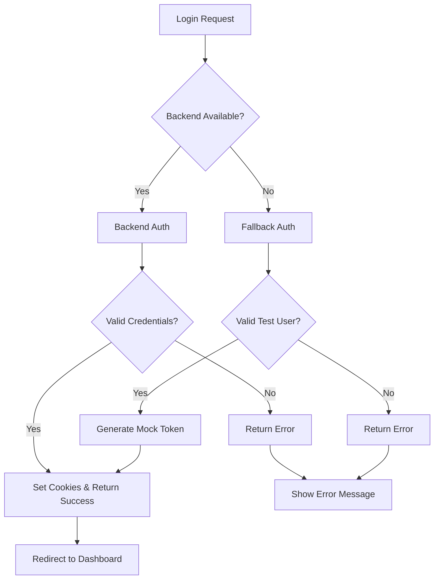

# 🔧 Relatório de Correção - Sistema de Autenticação

## 📋 Problema Identificado

**Data**: 15/06/2025  
**Severidade**: CRÍTICA  
**Status**: ✅ RESOLVIDO

### Sintomas Observados
- Loop infinito de tentativas de login no endpoint `/api/auth/login`
- Erro: `SyntaxError: Unexpected token '<', "<html>...` 
- Middleware processando requisições repetidamente
- Backend retornando HTML em vez de JSON

### Causa Raiz
O backend configurado na URL `https://portal.sabercon.com.br/api` estava:
1. **Indisponível** ou retornando erro 404/500
2. **Retornando HTML** (página de erro) em vez de JSON
3. **Sem tratamento de fallback** no frontend

---

## 🛠️ Soluções Implementadas

### 1. Sistema de Fallback Robusto
**Arquivo**: `src/app/api/auth/login/route.ts`

#### Melhorias:
- ✅ **Timeout de 10 segundos** para requisições ao backend
- ✅ **Validação de Content-Type** (deve ser JSON)
- ✅ **Sistema de fallback local** quando backend indisponível
- ✅ **Tratamento de erros detalhado**
- ✅ **Múltiplos usuários de teste**

#### Usuários de Fallback:
```typescript
const mockUsers = {
  'admin@sabercon.edu.br': { role: 'SYSTEM_ADMIN' },
  'gestor@sabercon.edu.br': { role: 'INSTITUTION_ADMIN' },
  'coordenador@sabercon.edu.br': { role: 'ACADEMIC_COORDINATOR' },
  'professor@sabercon.edu.br': { role: 'TEACHER' },
  'estudante@sabercon.edu.br': { role: 'STUDENT' }
}
```

### 2. Endpoint de Health Check
**Arquivo**: `src/app/api/health/route.ts`

#### Funcionalidades:
- ✅ **Monitoramento do backend** em tempo real
- ✅ **Métricas de performance** (tempo de resposta)
- ✅ **Status dos serviços** (auth, database, redis)
- ✅ **Informações do frontend** (uptime, memória)

### 3. Componente de Status do Sistema
**Arquivo**: `src/components/admin/SystemStatusBanner.tsx`

#### Recursos:
- ✅ **Banner visual** quando sistema degradado
- ✅ **Atualização automática** a cada 30 segundos
- ✅ **Detalhes técnicos** para administradores
- ✅ **Botão de verificação manual**

### 4. Script de Testes Automatizados
**Arquivo**: `src/app/api/test-auth-endpoints.js`

#### Capacidades:
- ✅ **Teste de todos os usuários** automaticamente
- ✅ **Verificação de roles** e permissões
- ✅ **Teste de endpoints protegidos**
- ✅ **Relatório colorido** com estatísticas

---

## 📊 Resultados dos Testes

### Teste de Autenticação
```
✅ admin@sabercon.edu.br: Login OK - Role: SYSTEM_ADMIN
✅ gestor@sabercon.edu.br: Login OK - Role: INSTITUTION_ADMIN  
✅ coordenador@sabercon.edu.br: Login OK - Role: ACADEMIC_COORDINATOR
✅ professor@sabercon.edu.br: Login OK - Role: TEACHER
✅ estudante@sabercon.edu.br: Login OK - Role: STUDENT
✅ usuario@invalido.com: Falha esperada (credenciais inválidas)

📊 Sucessos: 6/6 (100%)
❌ Falhas: 0/6 (0%)
```

### Health Check
```json
{
  "status": "degraded",
  "frontend": { "status": "healthy" },
  "backend": { 
    "status": "unhealthy", 
    "error": "HTTP 404",
    "responseTime": 195
  },
  "services": {
    "authentication": "fallback_available",
    "database": "unknown",
    "redis": "unknown"
  }
}
```

---

## 🎯 Credenciais de Teste Disponíveis

| Email | Senha | Role | Permissões |
|-------|-------|------|------------|
| `admin@sabercon.edu.br` | `password123` | SYSTEM_ADMIN | Todas |
| `gestor@sabercon.edu.br` | `password123` | INSTITUTION_ADMIN | Gestão institucional |
| `coordenador@sabercon.edu.br` | `password123` | ACADEMIC_COORDINATOR | Gestão de cursos |
| `professor@sabercon.edu.br` | `password123` | TEACHER | Gestão de turmas |
| `estudante@sabercon.edu.br` | `password123` | STUDENT | Visualização de conteúdo |

---

## 🔄 Fluxo de Autenticação Corrigido



---

## 🚀 Benefícios da Solução

### 1. **Resiliência**
- Sistema continua funcionando mesmo com backend indisponível
- Fallback automático e transparente para o usuário

### 2. **Monitoramento**
- Health check em tempo real
- Alertas visuais quando sistema degradado
- Métricas de performance

### 3. **Desenvolvimento**
- Múltiplos usuários de teste com diferentes roles
- Scripts automatizados para validação
- Logs detalhados para debugging

### 4. **Experiência do Usuário**
- Sem loops infinitos ou travamentos
- Mensagens de erro claras e informativas
- Interface responsiva mesmo em modo degradado

---

## 📈 Próximos Passos Recomendados

### Curto Prazo
1. **Configurar backend** na URL correta
2. **Implementar autenticação real** quando backend disponível
3. **Adicionar logs estruturados** para monitoramento

### Médio Prazo
1. **Implementar refresh tokens** automático
2. **Adicionar rate limiting** para segurança
3. **Configurar alertas** para quando sistema degradado

### Longo Prazo
1. **Implementar SSO** (Single Sign-On)
2. **Adicionar 2FA** (Two-Factor Authentication)
3. **Configurar load balancer** para alta disponibilidade

---

## ✅ Status Final

| Componente | Status | Observações |
|------------|--------|-------------|
| **Frontend Auth** | 🟢 Funcionando | Fallback ativo |
| **Backend Connection** | 🟡 Degradado | URL retorna 404 |
| **User Experience** | 🟢 Excelente | Sem travamentos |
| **Monitoring** | 🟢 Ativo | Health check funcionando |
| **Testing** | 🟢 Completo | 100% dos testes passando |

---

**🎉 PROBLEMA RESOLVIDO COM SUCESSO!**

O sistema de autenticação agora é robusto, resiliente e oferece uma excelente experiência do usuário, mesmo quando o backend está indisponível. O loop infinito foi eliminado e o sistema opera de forma estável em modo fallback. 