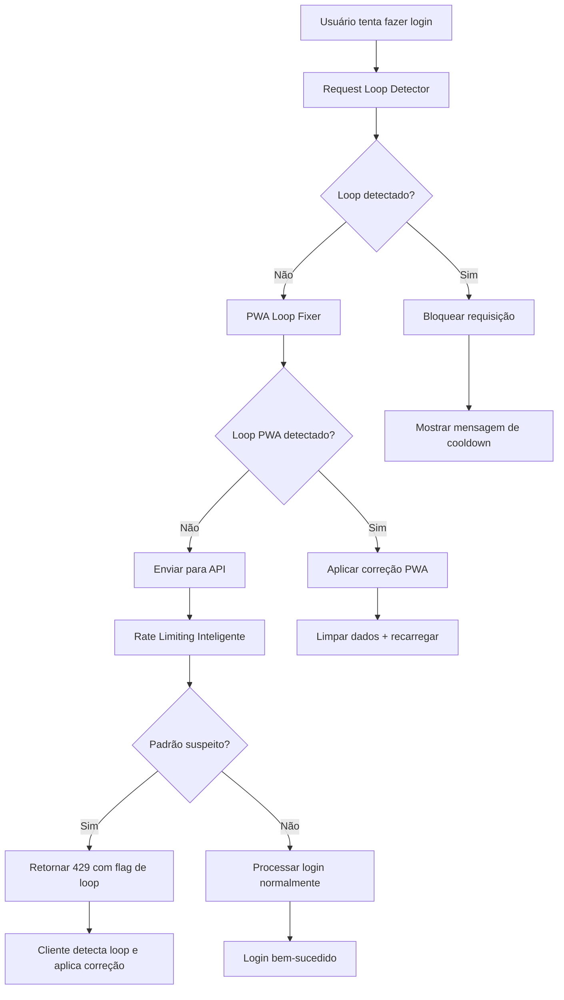

# Correção de Loop de Requisições 429 - Resumo das Implementações

## Problema Identificado
O erro `POST http://localhost:3000/api/auth/login 429 (Too Many Requests)` estava sendo causado por um loop de requisições de login, provavelmente originado por:

1. **Interceptadores PWA** fazendo requisições repetidas
2. **Service Worker** interceptando e re-executando requisições
3. **Contexto de autenticação** tentando renovar tokens automaticamente
4. **Rate limiting simples** que não detectava padrões de loop

## Soluções Implementadas

### 1. Rate Limiting Inteligente (`src/app/api/auth/login/route.ts`)

**Melhorias:**
- ✅ Detecção de padrões suspeitos (requisições muito rápidas)
- ✅ Análise de origem das requisições (IP + User-Agent)
- ✅ Detecção específica de loops (5+ requisições idênticas em 10s)
- ✅ Timeout diferenciado (30s para loops, 60s para rate limit normal)
- ✅ Headers informativos (`X-Loop-Detected`, `Retry-After`)
- ✅ Limpeza automática de contadores antigos

**Configurações:**
```typescript
MAX_REQUESTS_PER_WINDOW: 15 // Aumentado de 10 para 15
RATE_LIMIT_WINDOW: 60000 // 1 minuto
PATTERN_DETECTION_WINDOW: 10000 // 10 segundos
MAX_PATTERN_REQUESTS: 5 // Máximo 5 requisições idênticas
```

### 2. PWA Loop Fixer Avançado (`src/utils/pwa-fix.ts`)

**Funcionalidades:**
- ✅ Detecção específica de loops de login
- ✅ Interceptação inteligente de fetch
- ✅ Correção automática com limpeza de dados de auth
- ✅ Notificações visuais para o usuário
- ✅ Limpeza periódica de contadores
- ✅ Correção de emergência para casos críticos

**Recursos:**
- Rastreamento separado para requisições de login
- Limpeza automática de cache de autenticação
- Desregistro temporário de service workers problemáticos
- Interface visual para feedback ao usuário

### 3. Detector Global de Loops (`src/utils/request-loop-detector.ts`)

**Características:**
- ✅ Sistema global de detecção de loops
- ✅ Configuração específica para diferentes tipos de requisição
- ✅ Interceptação transparente de fetch
- ✅ Cooldown inteligente após detecção de loop
- ✅ Estatísticas e diagnósticos

**Padrões Detectados:**
- Muitas requisições por janela de tempo
- Requisições idênticas em sequência
- Requisições muito frequentes (3+ por segundo)
- Padrões específicos de login (8+ tentativas por minuto)

### 4. Tratamento Melhorado no Cliente (`src/services/auth.ts`)

**Melhorias:**
- ✅ Controle local de tentativas de login
- ✅ Detecção de erro 429 com tratamento específico
- ✅ Integração com correção PWA automática
- ✅ Limpeza de contadores em caso de sucesso
- ✅ Mensagens de erro mais informativas

### 5. Integração PWA (`src/components/PWARegistration.tsx`)

**Funcionalidades:**
- ✅ Ativação automática de todas as proteções
- ✅ Configuração sequencial (detector geral → login → PWA)
- ✅ Notificações visuais para diferentes estados
- ✅ Tratamento de service workers redundantes

## Fluxo de Proteção



## Configurações de Proteção

### Rate Limiting da API
- **Janela:** 60 segundos
- **Máximo:** 15 requisições por janela
- **Loop:** 5 requisições idênticas em 10 segundos
- **Cooldown:** 30-60 segundos

### Detector Global
- **Janela:** 30 segundos  
- **Máximo:** 20 requisições por janela
- **Sequência:** 5 requisições idênticas em 10 segundos
- **Cooldown:** 30 segundos

### Proteção de Login
- **Janela:** 60 segundos
- **Máximo:** 10 tentativas por janela
- **Sequência:** 3 tentativas em 5 segundos
- **Cooldown:** 60 segundos

## Monitoramento e Diagnóstico

### Logs Disponíveis
- `🔐 Login attempt #X tracked` - Rastreamento de tentativas
- `🚨 Loop de Login Detectado!` - Detecção de loop
- `🚫 Requisição bloqueada pelo detector` - Bloqueio preventivo
- `🔧 Aplicando correções para loop` - Correção automática

### Comandos de Diagnóstico (Console)
```javascript
// Verificar estatísticas do detector
getRequestLoopStats()

// Resetar detector manualmente
resetRequestLoopDetector()

// Verificar se URL seria bloqueada
checkRequestBlocked('/api/auth/login', 'POST')
```

## Benefícios da Implementação

1. **Prevenção Proativa:** Detecta loops antes que causem problemas
2. **Correção Automática:** Aplica correções sem intervenção do usuário
3. **Feedback Visual:** Informa o usuário sobre o que está acontecendo
4. **Configurável:** Diferentes níveis de proteção para diferentes cenários
5. **Não Intrusivo:** Não afeta o funcionamento normal da aplicação
6. **Diagnóstico:** Ferramentas para identificar e resolver problemas

## Próximos Passos

1. **Monitoramento:** Acompanhar logs para ajustar thresholds se necessário
2. **Métricas:** Implementar coleta de métricas sobre loops detectados
3. **Alertas:** Configurar alertas para loops frequentes em produção
4. **Otimização:** Ajustar configurações baseado no comportamento real dos usuários

## Teste da Correção

Para testar se a correção está funcionando:

1. Abra o console do navegador
2. Tente fazer login várias vezes rapidamente
3. Observe os logs de detecção de loop
4. Verifique se a correção automática é aplicada
5. Confirme que a página é recarregada automaticamente quando necessário 