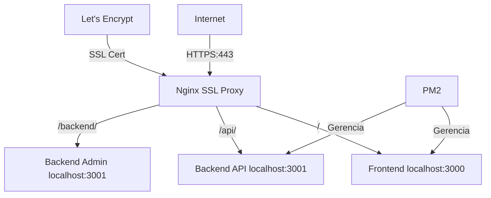

# 🔒 Configuração SSL Portal Sabercon

> **Configuração completa de SSL com Let's Encrypt para aplicações rodando em localhost:3000 (Frontend) e localhost:3001 (Backend)**

## 📋 Visão Geral

Este guia configura **HTTPS** para o Portal Sabercon usando:
- **Frontend**: `localhost:3000` (Next.js) → `https://54.232.72.62/`
- **Backend**: `localhost:3001` (API/Admin) → `https://54.232.72.62/api/` e `https://54.232.72.62/backend/`
- **SSL**: Certificados Let's Encrypt gratuitos
- **Proxy**: Nginx como proxy reverso
- **PWA**: Funcionamento completo com HTTPS

## 🚀 Scripts Disponíveis

### 1. `quick-ssl-setup.sh` - Configuração Rápida
```bash
sudo bash quick-ssl-setup.sh
```
- ✅ Configuração automática em ~5 minutos
- ✅ Ideal para teste e desenvolvimento
- ✅ Configuração básica mas funcional

### 2. `setup-ssl.sh` - Configuração Completa
```bash
sudo bash setup-ssl.sh
```
- ✅ Configuração otimizada para produção
- ✅ Headers de segurança avançados
- ✅ Rate limiting e otimizações
- ✅ Monitoramento automático
- ✅ Backup de configurações

## 📋 Pré-requisitos

### 1. Aplicações Rodando
```bash
# Verificar se estão rodando
pm2 list

# Deve mostrar:
# PortalServerFrontend (porta 3000)
# PortalServerBackend (porta 3001)
```

### 2. Sistema Atualizado
```bash
sudo apt update && sudo apt upgrade -y
```

### 3. Acesso Root
```bash
sudo su
```

## 🛠️ Passo a Passo - Configuração Rápida

### 1. Executar Deploy
```bash
# Garantir que as aplicações estão rodando
bash deploy.sh
```

### 2. Configurar SSL
```bash
# Opção 1: Rápida (recomendada para começar)
sudo bash quick-ssl-setup.sh

# Opção 2: Completa (para produção)
sudo bash setup-ssl.sh
```

### 3. Verificar Funcionamento
```bash
# Testar URLs
curl -I https://54.232.72.62/          # Frontend
curl -I https://54.232.72.62/api/      # Backend API  
curl -I https://54.232.72.62/backend/  # Backend direto
```

## 🌐 URLs Resultantes

| Serviço | URL HTTPS | Proxy Para |
|---------|-----------|------------|
| 📱 **Frontend** | `https://54.232.72.62/` | `localhost:3000` |
| 🔧 **Backend API** | `https://54.232.72.62/api/` | `localhost:3001/api/` |
| 🔧 **Backend Admin** | `https://54.232.72.62/backend/` | `localhost:3001/` |

## 📊 Arquitetura do Sistema



## 🔧 Configuração Nginx Gerada

### Frontend (Raiz)
```nginx
location / {
    proxy_pass http://localhost:3000;
    proxy_set_header Host $host;
    proxy_set_header X-Real-IP $remote_addr;
    proxy_set_header X-Forwarded-For $proxy_add_x_forwarded_for;
    proxy_set_header X-Forwarded-Proto $scheme;
    
    # Headers para PWA
    proxy_set_header Upgrade $http_upgrade;
    proxy_set_header Connection 'upgrade';
}
```

### Backend API
```nginx
location /api/ {
    proxy_pass http://localhost:3001/api/;
    proxy_set_header Host $host;
    
    # CORS headers
    add_header Access-Control-Allow-Origin * always;
    add_header Access-Control-Allow-Methods "GET, POST, PUT, DELETE, OPTIONS" always;
}
```

### Backend Direto
```nginx
location /backend/ {
    proxy_pass http://localhost:3001/;
    proxy_set_header Host $host;
}
```

## 🔍 Verificação e Diagnóstico

### Verificar Status dos Serviços
```bash
# Status geral
systemctl status nginx
pm2 list
certbot certificates

# Verificar portas
netstat -tlnp | grep -E "(3000|3001|80|443)"

# Logs
tail -f /var/log/nginx/access.log
tail -f /var/log/nginx/error.log
pm2 logs PortalServerFrontend
pm2 logs PortalServerBackend
```

### Testar Conectividade
```bash
# Testar Frontend
curl -I https://54.232.72.62/

# Testar Backend API
curl -I https://54.232.72.62/api/

# Testar Backend direto  
curl -I https://54.232.72.62/backend/

# Testar PWA
curl -s https://54.232.72.62/manifest.json
```

### Verificar Certificado SSL
```bash
# Informações do certificado
openssl s_client -connect 54.232.72.62:443 -servername 54.232.72.62

# Expiração
certbot certificates

# Testar renovação
certbot renew --dry-run
```

## 🚨 Solução de Problemas

### ❌ Erro: "Certificado SSL falhou"
```bash
# Verificar se aplicações estão rodando
pm2 list

# Verificar se portas estão abertas
ufw status
netstat -tlnp | grep -E "(80|443)"

# Verificar DNS/conectividade
ping 54.232.72.62
curl -I http://54.232.72.62
```

### ❌ Erro: "Nginx não inicia"
```bash
# Testar configuração
nginx -t

# Ver logs de erro
tail -f /var/log/nginx/error.log

# Resetar configuração
cp /etc/nginx/sites-available/default.backup /etc/nginx/sites-available/default
systemctl restart nginx
```

### ❌ PWA não funciona
```bash
# Verificar HTTPS
curl -I https://54.232.72.62/

# Verificar headers PWA
curl -s https://54.232.72.62/ | grep -i "content-security\|x-frame"

# Verificar manifest
curl -s https://54.232.72.62/manifest.json
```

### ❌ Backend API não responde
```bash
# Verificar se backend está rodando
pm2 logs PortalServerBackend

# Testar direto na porta 3001
curl -I http://localhost:3001/

# Verificar proxy nginx
nginx -t
tail -f /var/log/nginx/access.log
```

## 🔄 Renovação Automática

### Configuração
```bash
# Verificar timer
systemctl status certbot.timer

# Ativar renovação automática
systemctl enable certbot.timer
systemctl start certbot.timer

# Testar renovação
certbot renew --dry-run
```

### Monitoramento
```bash
# Script de verificação (criado automaticamente)
/usr/local/bin/portal-ssl-check.sh

# Ver logs de verificação
tail -f /var/log/portal-ssl-check.log
```

## ⚡ Otimizações Aplicadas

### Security Headers
- `Strict-Transport-Security`
- `X-Content-Type-Options`
- `X-Frame-Options`
- `X-XSS-Protection`

### Performance
- Gzip compression
- Static file caching
- Connection keep-alive
- Rate limiting

### PWA Support
- Service Worker headers
- Manifest caching
- HTTPS redirect
- WebSocket proxy

## 📞 Comandos Úteis

```bash
# Status completo
systemctl status nginx
pm2 list
certbot certificates

# Restart serviços
systemctl restart nginx
pm2 restart all

# Verificar SSL
openssl s_client -connect 54.232.72.62:443

# Logs em tempo real
tail -f /var/log/nginx/access.log
pm2 logs

# Backup configuração
cp /etc/nginx/sites-available/default /root/nginx-backup-$(date +%Y%m%d).conf
```

## 🎯 Resultado Final

✅ **Frontend PWA**: `https://54.232.72.62/` → `localhost:3000`
✅ **Backend API**: `https://54.232.72.62/api/` → `localhost:3001/api/`  
✅ **Backend Admin**: `https://54.232.72.62/backend/` → `localhost:3001/`
✅ **SSL Automático**: Renovação a cada 90 dias
✅ **PWA Funcional**: Service Worker + Manifest
✅ **Performance**: Cache, Gzip, Headers otimizados
✅ **Segurança**: Headers de segurança completos

---

🎉 **Portal Sabercon com SSL configurado e funcionando!** 