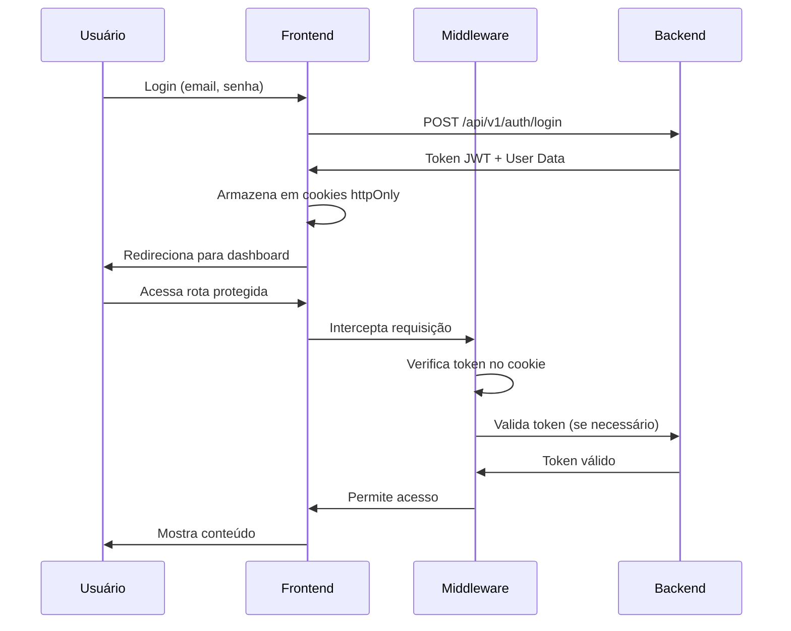

# Resumo da Refatoração do Sistema de Autenticação

## Alterações Realizadas

### 1. Middleware (`src/middleware.ts`)
- ✅ Adicionado suporte para variáveis de ambiente do backend
- ✅ Refatorado validação de sessão para usar nova API
- ✅ Melhorado sistema de redirecionamento baseado em roles
- ✅ Adicionado headers de sessão nas respostas

### 2. Rotas de API

#### `/api/auth/login/route.ts` (NOVO)
- Integração com backend para autenticação
- Gerenciamento de cookies httpOnly
- Suporte para tokens JWT e refresh tokens

#### `/api/auth/logout/route.ts` (NOVO)
- Notificação ao backend sobre logout
- Limpeza completa de cookies
- Headers de cache para evitar problemas

#### `/api/auth/validate/route.ts` (NOVO)
- Validação de tokens com o backend
- Suporte para validação via GET e POST

#### `/api/auth/register/route.ts` (NOVO)
- Registro de novos usuários via backend
- Configuração automática de cookies após registro

### 3. Serviço de Autenticação (`src/services/auth.ts`)
- ✅ Refatorado para usar novas rotas de API
- ✅ Removido mock data para login/registro
- ✅ Melhorado gerenciamento de cookies e localStorage
- ✅ Adicionado validação de token com backend

### 4. AuthContext (`src/contexts/AuthContext.tsx`)
- ✅ Reescrito completamente para nova arquitetura
- ✅ Hooks customizados: `useRequireAuth` e `useRequireRole`
- ✅ Gerenciamento de estado centralizado
- ✅ Redirecionamento automático baseado em roles

### 5. Dashboard Layout (`src/app/dashboard/layout.tsx`)
- ✅ Adicionado proteção de autenticação
- ✅ Loading state enquanto verifica autenticação
- ✅ Redirecionamento automático para login se não autenticado

### 6. Configuração de Ambiente (`.env.local`)
```env
BACKEND_URL=http://localhost:3001
API_VERSION=v1
NEXTAUTH_URL=http://localhost:3000
NEXTAUTH_SECRET=your-secret-key-here
```

### 7. Página de Teste (`src/app/test-auth-integration/page.tsx`)
- Interface para testar login com diferentes roles
- Botão para testar conexão com backend
- Lista de usuários de teste com credenciais

## Como Usar

### 1. Iniciar o Backend
```bash
cd backend
npm install
npm run dev
```

### 2. Iniciar o Frontend
```bash
npm install
npm run dev
```

### 3. Testar Autenticação
- Acesse: http://localhost:3000/test-auth-integration
- Teste a conexão com o backend
- Faça login com diferentes usuários

## Fluxo de Autenticação



## Benefícios da Nova Arquitetura

1. **Segurança Aprimorada**
   - Tokens em cookies httpOnly
   - Validação server-side
   - CORS configurado

2. **Melhor UX**
   - Redirecionamento automático
   - Loading states apropriados
   - Mensagens de erro claras

3. **Manutenibilidade**
   - Código mais organizado
   - Separação de responsabilidades
   - Fácil adicionar novos providers

4. **Escalabilidade**
   - Pronto para refresh tokens
   - Suporte para múltiplos backends
   - Cache de validação

## Próximos Passos Recomendados

1. Implementar refresh token rotation
2. Adicionar rate limiting nas rotas de auth
3. Implementar 2FA
4. Adicionar logs de auditoria
5. Implementar recuperação de senha
6. Adicionar testes automatizados

## Troubleshooting

### "Dashboard não aparece"
1. Verifique se o backend está rodando
2. Confirme as variáveis de ambiente
3. Limpe cookies e faça login novamente
4. Verifique o console do navegador

### "Erro de CORS"
1. Verifique CORS_ORIGIN no backend
2. Confirme que as URLs estão corretas
3. Verifique se está usando http/https correto

### "Token inválido"
1. Verifique JWT_SECRET no backend
2. Confirme que os cookies estão sendo enviados
3. Verifique a expiração do token